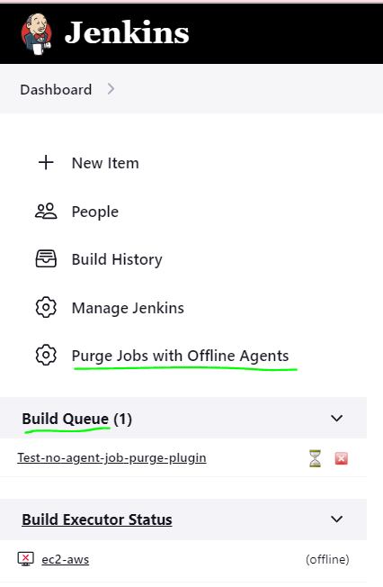
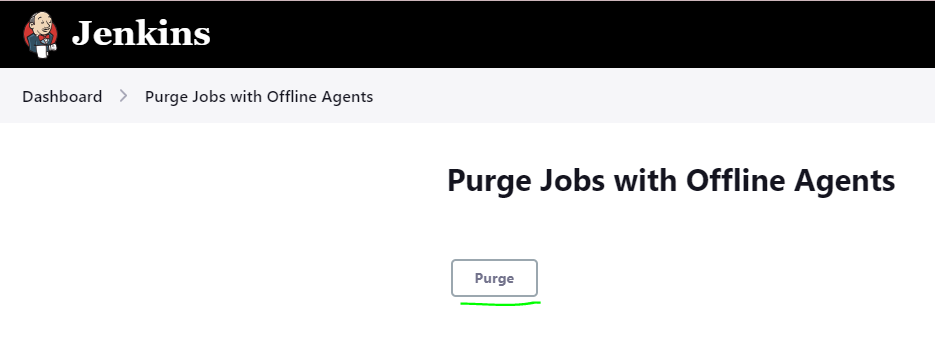

# no-agent-job-purge-plugin
A Jenkins plugin to purge jobs from the build queue if there is no agent available to take it.  

After installing the plugin, you can see the "Purge Jobs with Offline Agents" option in dashboard page Uder root actions.  

If you want to purge jobs from build queue, then click on "Purge Jobs with Offline Agents" and click on "Purge" button.  

## Version history

See [GitHub Releases](https://github.com/jenkinsci/no-agent-job-purge-plugin/releases)